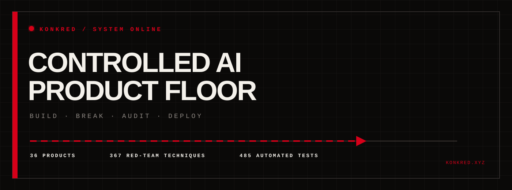
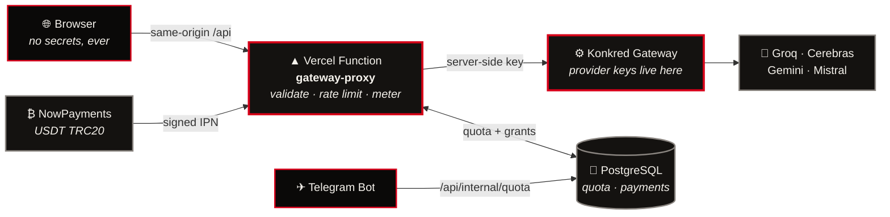
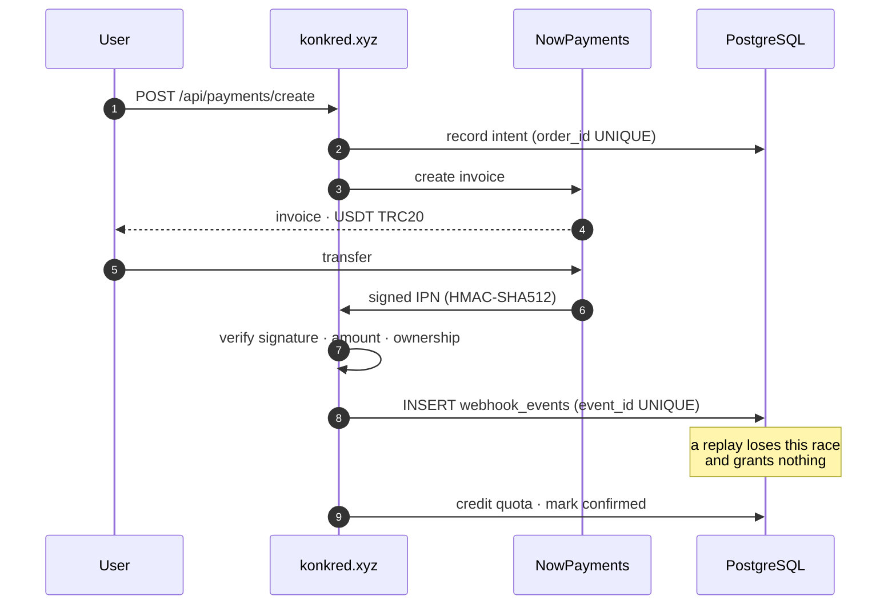

<!--
  KONKRED — konkred.xyz
  FACTORY FLOOR theme · Black #0A0908 · Red #D60019 · Ink #F4F1EB
  Type: Archivo Black (display) · Special Elite (prose) · JetBrains Mono (machine)

  Red means signal and live state, never danger. The background never glows —
  only foreground objects ignite.

  Artwork is generated:  python3 tools/build_assets.py
  Do not hand-edit assets/*.svg — regenerate them.
-->

<div align="center">

<a href="https://konkred.xyz">
  
</a>

<br>

[](https://konkred.xyz)
[](mailto:ari@konkred.xyz)
[](#-quality-bar)
[](#-licence)

</div>


## `>` WHAT THIS IS

**KONKRED** is a production AI platform, not a demo. It ships four things that
share one gateway, one identity model, one quota ledger and one payment system:

> **An AI app builder** that turns a prompt into a running project.
> **A red-team service** that tries to break language models before your users do.
> **A certification pipeline** that makes a prompt auditable.
> **A catalogue** of 36 executive workflows with fixtures and validators.

Everything is metered, every failure is a controlled JSON contract, and every
guarantee in this document is backed by a test you can run.


<details>
<summary><b>&nbsp;⟶&nbsp; fullKONK_&gt; — prompt to running application</b></summary>

<br>

Describe an app; get a working project with real files.

| Capability | Detail |
|---|---|
| **Pipeline** | `architect → build → verify` streamed live over SSE |
| **Providers** | Groq, Cerebras, Gemini, Mistral, OpenRouter, Cloudflare, GitHub Models |
| **Failover** | Automatic provider rotation with cooldowns; the stream reports every switch |
| **Modes** | `fullstack` · `frontend` · `backend` · `review` |
| **Export** | Server-side push to GitHub with strict path validation |
| **BYOK** | Bring your own provider key; it is never stored |

Stream events: `stage` `provider` `failover` `metrics` `delta` `file` `reset` `done` `error`

**Retrying never double-charges.** The client sends one idempotency key per
logical generation, scoped server-side under your identity — so a reconnect
cannot be billed twice, and cannot be pointed at somebody else's balance.

</details>

<details>
<summary><b>&nbsp;⟶&nbsp; REDAEYE — LLM red teaming</b></summary>

<br>

Adversarial testing against a corpus of **367 techniques**: prompt injection,
jailbreaks, role confusion, data exfiltration, tool misuse and encoding
attacks. Output is an evidence-backed report with reproduction steps, not a
score with no provenance.

</details>

<details>
<summary><b>&nbsp;⟶&nbsp; AUDIT — prompt certification</b></summary>

<br>

Turns a prompt into something an enterprise can approve: input/output schemas,
provenance checking, safety gates, a public fixture, a validator, and written
approval instructions.

</details>

<details>
<summary><b>&nbsp;⟶&nbsp; CATALOGUE — 36 executive workflows</b></summary>

<br>

**21 suites** and **15 validated workflows** across finance, legal, support,
engineering and operations — each with a fixture, a validator and a deployment
guide. Browse at [konkred.xyz/catalogue](https://konkred.xyz/catalogue).

</details>


## `>` ARCHITECTURE

Secrets never reach the browser. The site holds no provider keys; the gateway
holds no payment state. That separation is the whole design.



### The money path




<div align="center"><sub>Planning ranges. Exact quotes come from a scoping call — nothing is charged on this site.</sub></div>


## `>` QUICK START

```bash
git clone https://github.com/reARbitRA/konkred_xyz-
cd konkred_xyz- && npm install
npm run dev                      # http://localhost:3000
```

<details>
<summary><b>&nbsp;⟶&nbsp; Full local stack (billing, payments and AI, entirely offline)</b></summary>

<br>

No credentials and no network required — the mock gateway and mock payment
provider stand in for the real services.

```bash
# 1 — real PostgreSQL (an in-memory emulator hides real bugs; see below)
python3 -m venv /tmp/pgvenv && /tmp/pgvenv/bin/pip install pgserver
/tmp/pgvenv/bin/python scripts/dev/start-postgres.py &

export DATABASE_URL="postgresql://postgres@localhost/postgres?host=/tmp/pgdata"
bash scripts/setup-database.sh        # migrate + prove the UNIQUE constraints

# 2 — stand-ins for the paid services
node scripts/dev/mock-gateway.mjs 5055 &
node scripts/dev/mock-nowpayments.mjs 5066 &

# 3 — the site
KONKRED_GATEWAY_URL=http://127.0.0.1:5055 \
KONKRED_GATEWAY_API_KEY=dev FULLKONK_KEY=dev ANON_SALT=dev \
INTERNAL_API_KEY=dev NOWPAYMENTS_API_KEY=dev \
NOWPAYMENTS_IPN_SECRET=dev-ipn-secret \
NOWPAYMENTS_API_BASE=http://127.0.0.1:5066 \
TRIAL_MESSAGES=3 npm run dev
```

Then watch the paywall engage on the fourth call:

```bash
for i in 1 2 3 4; do
  curl -s -o /dev/null -w "call $i → %{http_code}\n" -X POST \
    -H 'content-type: application/json' \
    -d '{"messages":[{"role":"user","content":"hi"}]}' \
    localhost:3000/api/ai
done
# call 1 → 200   call 2 → 200   call 3 → 200   call 4 → 402
```

</details>

### Commands

| Command | What it does |
|---|---|
| `npm run dev` | Dev server with HMR on `:3000` |
| `npm test` | 485 tests (6 skip without a database) |
| `npm run lint` | `tsc --noEmit` |
| `npm run build:vercel` | Client bundle + API bundle |
| `bash scripts/setup-secrets.sh` | Generate secrets into a gitignored `0600` file |
| `bash scripts/setup-database.sh` | Apply the migration and verify its constraints |
| `bash scripts/verify-production.sh <url>` | 27 post-deploy checks; non-zero exit on failure |
| `python3 tools/build_assets.py` | Regenerate this README's artwork |


## `>` API

Every route returns JSON. **No route ever returns HTML** — a regression test
enforces it, because an API answering `<!DOCTYPE html>` once made a real outage
much harder to diagnose.

| Route | Auth | Purpose |
|---|---|---|
| `GET /api/health` | public | Liveness. Always 200 if the function runs. Config reported as **booleans only** |
| `GET /api/ready` | public | Readiness. Probes the gateway with a 5 s timeout; degrades to 503 |
| `GET /api/fullkonk/providers` | public | Provider catalogue |
| `POST /api/fullkonk/generate` | metered | SSE build pipeline |
| `POST /api/fullkonk/github/export` | metered | Server-side GitHub export |
| `POST /api/ai` | metered | Chat completion |
| `GET /api/quota` | identity | Remaining balance |
| `GET /api/payments/plans` | public | Plan catalogue + network warning |
| `POST /api/payments/create` | identity | Create an invoice · 10/hour/identity |
| `POST /api/payments/nowpayments/webhook` | **signature** | Provider callback |
| `/api/internal/quota/*` | service token | Shared quota for the Telegram bot |

<details>
<summary><b>&nbsp;⟶&nbsp; Error contract</b></summary>

<br>

Failures are machine-readable and never leak internals. User-facing text is
Persian; diagnostics go to logs only.

| Code | Status | Meaning |
|---|---|---|
| `GATEWAY_NOT_CONFIGURED` | 503 | No gateway URL set |
| `GATEWAY_UNREACHABLE` / `GATEWAY_TIMEOUT` | 503 | Gateway down or slow |
| `QUOTA_EXHAUSTED` | **402** | Out of messages; carries `upgradeUrl` |
| `TOO_MANY_PAYMENT_ATTEMPTS` | 429 | Invoice throttle; carries `Retry-After` |
| `INVALID_SIGNATURE` | 401 | Webhook rejected before touching state |
| `BILLING_UNAVAILABLE` | 503 | Database unreachable — retryable |
| `ROUTE_NOT_FOUND` | 404 | Unknown API path (JSON, never the SPA shell) |

</details>


## `>` SECURITY POSTURE

Written as **attacks**, not assertions — `tests/security-audit.test.ts` mounts
the real handler and attacks it.

| Threat | Defence |
|---|---|
| Quota bypass | Every inference route is metered. `/api/ai` was once unmetered — that hole is closed and guarded by a test |
| Webhook forgery | HMAC-SHA512 over the **recursively** key-sorted body, constant-time compare |
| Webhook replay | `webhook_events.event_id` is `UNIQUE` — the **database** arbitrates, not application code |
| Identity forgery | Identity is always server-derived. A client `x-end-user` header is ignored |
| Path traversal | Export rejects absolute paths, `..`, `.git/`, `.env` and `.github/workflows/` |
| SSRF | Upstream paths are hard-coded constants; no client input reaches a URL |
| Credential injection | A browser-supplied GitHub token is dropped, never forwarded |
| Secret leakage | Client bundle scanned in CI; upstream responses screened before relay |
| CORS | Billing routes are same-origin only; preflight from another origin is refused |
| Transport | Database TLS certificates verified by default |
| DoS | Body-size caps, per-route rate limits, SQL-counted invoice throttle |

> **Non-custodial by design.** Funds settle directly to the owner's address.
> No seed phrase or private key is ever stored, requested or logged.


## `>` QUALITY BAR

```
485 tests · 25 files · tsc clean · 14/14 guards proven by reversion
```

Three practices this project holds to, each of which caught a real bug:

**1 — Verify against real infrastructure.** The billing suite runs against a
real PostgreSQL server, not only an in-memory emulator. That is how a
**connection-pool deadlock** was found: a method requested a second connection
while holding one, so ten concurrent duplicate webhooks hung for 30 seconds.
The emulator did not reproduce it. In production that is a wedged payment
endpoint under exactly the retry storm providers generate.

**2 — Prove a regression test actually fails.** The "no infinite loading"
tests were checked against a **deliberately reverted fix**. A test that passes
with and without the fix is worthless.

**3 — Never weaken a guard that fails.** The secret scanner, the no-fakes
check and the bundle-hygiene test each caught genuine mistakes during
development. Every time, the code was fixed — not the test.


## `>` DEPLOYMENT

Full sequence in **[`docs/DEPLOY_RUNBOOK.md`](./docs/DEPLOY_RUNBOOK.md)**.

```bash
bash scripts/setup-secrets.sh                 # generate secrets
bash scripts/setup-database.sh                # migrate + verify
# set Vercel env vars, deploy with the build cache cleared
bash scripts/verify-production.sh https://www.konkred.xyz
```

> **Never prefix a secret with `VITE_`.** That compiles it into browser
> JavaScript. Provider keys belong on the gateway only — never on the website.

<details>
<summary><b>&nbsp;⟶&nbsp; Documentation index</b></summary>

<br>

| Document | Contents |
|---|---|
| [`docs/DEPLOY_RUNBOOK.md`](./docs/DEPLOY_RUNBOOK.md) | Ordered deployment, env vars, verification |
| [`docs/ROUTE_AUDIT.md`](./docs/ROUTE_AUDIT.md) | Every route: status, owner, auth, root cause, fix |
| [`docs/INCIDENT_AND_DEPLOYMENT.md`](./docs/INCIDENT_AND_DEPLOYMENT.md) | Outage analysis + Persian operational guide |
| [`docs/PHASE_STATUS.md`](./docs/PHASE_STATUS.md) | Honest status, including what is **not** done |
| [`integrations/telegram/README.md`](./integrations/telegram/README.md) | Bot quota integration |
| [`HANDOFF.md`](./HANDOFF.md) | Outstanding work and known traps |

</details>


## `>` LICENCE

Proprietary. © KONKRED. All rights reserved.
Contact **[ari@konkred.xyz](mailto:ari@konkred.xyz)** for licensing.


<div align="center">

<a href="mailto:ari@konkred.xyz">
  
</a>

<br>

**[konkred.xyz](https://konkred.xyz)** · **[ari@konkred.xyz](mailto:ari@konkred.xyz)** · **[GitHub](https://github.com/reARbitRA)**

<sub>Concrete tools for abstract problems.</sub>

<sub>KONKRED — Factory Floor · Black #0A0908 · Red #D60019 · Ink #F4F1EB</sub>

</div>
