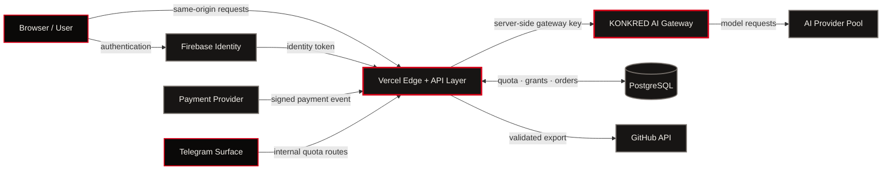
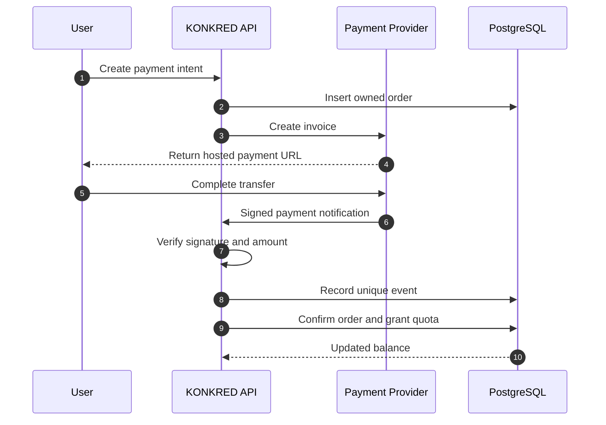

<!--
  KONKRED.XYZ
  CONTROLLED AI PRODUCT FLOOR

  Visual doctrine:
  Black #0A0908 · Signal Red #D60019 · Ink #F4F1EB
  Red means live signal, execution and power — never decoration.
  The background stays dark. Only active machinery ignites.

  Product doctrine:
  No invisible magic.
  No unmetered execution.
  No unverified output.
  No secret in the browser.
  Every action has a state, contract, limit and evidence trail.
-->

<div align="center">

<a href="https://konkred.xyz">
  
</a>

<br>

# KONKRED.XYZ

### CONTROLLED AI PRODUCT FLOOR  
### BUILD · BREAK · AUDIT · DEPLOY

<br>

[](https://konkred.xyz)
[](https://konkred.xyz/catalogue)
[](https://konkred.xyz/redaeye)
[](#quality-bar)
[](https://www.typescriptlang.org)
[](https://react.dev)

<br>

> **KONKRED is a production-oriented AI platform where generation, security, validation, metering, payment and delivery operate as one system.**

[Open Platform](https://konkred.xyz) ·
[Explore Catalogue](https://konkred.xyz/catalogue) ·
[Run fullKONK](https://konkred.xyz/fullkonk) ·
[Enter REDAEYE](https://konkred.xyz/redaeye) ·
[Inspect Documentation](./SYSTEM_DOCUMENTATION.md)

</div>

---

## `00 / SYSTEM IDENTITY`

KONKRED is not a landing page wrapped around an AI API.

It is a controlled product floor for designing, generating, attacking, validating, metering and delivering AI-powered systems.

The platform combines four operating surfaces:

| Station | Function | Output |
|---|---|---|
| **fullKONK** | Architect and generate software projects | Structured source files, build stream, verification state and GitHub export |
| **REDAEYE** | Adversarially test AI systems | Technique-driven findings, evidence and remediation paths |
| **AUDIT** | Convert prompts into controlled enterprise artifacts | Schemas, fixtures, validators, provenance and approval records |
| **CATALOGUE** | Operate 36 packaged workflow products | Controlled tools across legal, finance, engineering, support and operations |

These surfaces are not disconnected demos.

They share the machinery that makes an AI product operational:

- identity;
- authentication;
- provider orchestration;
- quota metering;
- payment grants;
- idempotency;
- streaming;
- validation;
- error contracts;
- evidence;
- deployment paths.

```text
                          KONKRED CONTROL PLANE
┌──────────────────────────────────────────────────────────────────────────┐
│                                                                          │
│  BUILD                BREAK                AUDIT              OPERATE     │
│  fullKONK             REDAEYE              CERTIFICATION      CATALOGUE   │
│     │                    │                     │                   │       │
│     └────────────────────┴──────────┬──────────┴───────────────────┘       │
│                                     │                                    │
│                          SHARED PRODUCT RAIL                             │
│                                     │                                    │
│    IDENTITY · QUOTA · PAYMENTS · PROVIDERS · VALIDATION · EVIDENCE       │
│                                                                          │
└──────────────────────────────────────────────────────────────────────────┘
```

---

## `01 / WHY THIS SYSTEM EXISTS`

The visible AI call is the smallest part of an AI product.

The difficult work begins around it:

- What happens when the selected provider is unavailable?
- How is a retry prevented from charging twice?
- Where are API credentials stored?
- How is generated output validated before it becomes a file?
- How does a disconnected browser resume a build?
- How are limits enforced per user?
- How does payment become usable quota?
- How is a failed operation represented?
- How can a reviewer inspect the source of a claim?
- How does generated code leave the platform safely?
- How are security failures exposed instead of hidden?

KONKRED is built around those questions.

Every major action is treated as a controlled transition:

```text
INTENT
  │
  ▼
IDENTITY CHECK
  │
  ▼
QUOTA ADMISSION
  │
  ▼
PROVIDER ROUTING
  │
  ▼
CONTROLLED EXECUTION
  │
  ▼
OUTPUT VALIDATION
  │
  ▼
METERING + EVIDENCE
  │
  ▼
DELIVERY
```

The system does not rely on an illusion of autonomy.

It exposes progress, provider changes, failure states, limits, source files and verification results as first-class product information.

---

# `02 / THE FOUR PRODUCT STATIONS`

## `02.1 / fullKONK_>`

### Prompt to structured software project

fullKONK turns a product request into a live, inspectable build process.

The user does not wait behind a generic loading spinner. The pipeline reports what the system is doing as it happens.

```text
PROMPT
  │
  ▼
ARCHITECT
  │  system structure · file plan · implementation strategy
  ▼
BUILD
  │  source generation · provider events · file emission
  ▼
VERIFY
  │  structural checks · output review · completion contract
  ▼
DELIVER
     workspace · download · persistence · GitHub export
```

### Build modes

| Mode | Purpose |
|---|---|
| `fullstack` | Generate a connected frontend and backend project |
| `frontend` | Build interface, interaction and client-side architecture |
| `backend` | Build services, API contracts and server-side logic |
| `review` | Inspect and improve an existing project or attached source |

### Live stream protocol

Generation is delivered through Server-Sent Events.

The client understands explicit event types:

| Event | Meaning |
|---|---|
| `stage` | Pipeline entered a new operating stage |
| `provider` | Active provider and model changed |
| `failover` | Current route failed and another route was selected |
| `metrics` | Usage, timing or quota information changed |
| `delta` | Incremental generated output |
| `file` | A complete project file became available |
| `reset` | Stream state was intentionally rebuilt |
| `done` | Generation completed successfully |
| `error` | A typed failure contract was returned |

### Resilient generation

A build request receives a scoped idempotency key.

```text
ONE USER INTENT
      │
      ├── initial request
      ├── browser reconnect
      ├── network retry
      └── stream recovery
              │
              ▼
      ONE LOGICAL GENERATION
      ONE METERING DECISION
```

The key is bound to the authenticated identity and logical generation. A reconnect cannot silently become a second charge or be redirected toward another user’s balance.

### Project workspace

Generated files are mounted into a project workspace with:

- file navigation;
- language-aware rendering;
- code inspection;
- change comparison;
- build-session state;
- project persistence;
- ZIP download;
- GitHub export.

### GitHub export

Source leaves the platform through a server-side boundary.

The export path includes:

- authenticated ownership;
- repository selection;
- branch targeting;
- normalized paths;
- path traversal protection;
- prohibited path checks;
- file validation;
- controlled commit creation.

Provider tokens and GitHub credentials are not exposed to the browser.

---

## `02.2 / REDAEYE`

### Adversarial testing for language-model systems

REDAEYE is the hostile testing station of KONKRED.

It evaluates prompts, agent boundaries and model-facing systems against a corpus of 367 adversarial techniques organized into 18 detection families.

The objective is not to generate a decorative security score.

The objective is to expose:

- the attack;
- the affected boundary;
- the model behavior;
- the evidence;
- the severity;
- the remediation path.

### Detection families

REDAEYE’s test surface covers families including:

- direct prompt injection;
- indirect prompt injection;
- instruction hierarchy attacks;
- role confusion;
- system-prompt extraction;
- context poisoning;
- encoded payloads;
- multilingual bypass;
- jailbreak patterns;
- tool misuse;
- data exfiltration;
- unsafe delegation;
- output manipulation;
- policy collision;
- excessive agency;
- memory contamination;
- boundary erosion;
- adversarial chaining.

### Assessment flow

```text
TARGET DEFINITION
      │
      ▼
ATTACK FAMILY SELECTION
      │
      ▼
TECHNIQUE EXECUTION
      │
      ▼
RESPONSE CAPTURE
      │
      ▼
EVIDENCE CLASSIFICATION
      │
      ▼
RISK + REMEDIATION
```

### Result model

A finding can carry:

- technique identifier;
- family;
- attack payload;
- observed output;
- reproduction path;
- severity;
- confidence;
- affected boundary;
- recommended mitigation;
- reviewer state.

REDAEYE is designed for engineering review, not theatrical fear.

---

## `02.3 / AUDIT`

### Prompt certification and controlled approval

AUDIT transforms a prompt from an informal block of text into an inspectable enterprise artifact.

A prompt entering an organization must be more than “well written.” It must have a defined operating contract.

AUDIT packages that contract.

### Certification surface

A controlled prompt can include:

- purpose;
- allowed scope;
- prohibited scope;
- input schema;
- output schema;
- required context;
- source requirements;
- safety gates;
- deterministic fixtures;
- validation rules;
- provenance fields;
- human-review instructions;
- approval state.

### Audit pipeline

```text
RAW PROMPT
   │
   ▼
SCOPE EXTRACTION
   │
   ▼
INPUT / OUTPUT CONTRACT
   │
   ▼
RISK AND FAILURE ANALYSIS
   │
   ▼
FIXTURE GENERATION
   │
   ▼
VALIDATOR LINKAGE
   │
   ▼
HUMAN APPROVAL RECORD
```

### Evidence over adjectives

AUDIT avoids untestable labels such as:

- “enterprise-grade”;
- “fully safe”;
- “highly accurate”;
- “production-ready.”

Instead, it produces inspectable artifacts:

```text
CLAIM
  ├── fixture
  ├── validation rule
  ├── source or provenance
  ├── expected boundary
  └── reviewer instruction
```

The result is a prompt that can enter a real approval process.

---

## `02.4 / CATALOGUE`

### 36 controlled workflow products

The KONKRED catalogue contains 36 packaged products:

- 21 suites;
- 15 ready-to-run workflows.

The products cover:

- finance;
- legal operations;
- engineering;
- customer support;
- management;
- procurement;
- compliance;
- property;
- documentation;
- strategic operations.

Each catalogue entry is modeled as a product record rather than a marketing card.

### Product record

A record can define:

- stable ID;
- slug;
- product family;
- buyer;
- problem;
- inputs;
- outputs;
- fixtures;
- validator;
- evidence;
- deployment guidance;
- operational status;
- human-review boundary.

### Controlled workflow contract

```text
INPUT
  │
  ▼
SCHEMA CHECK
  │
  ▼
WORKFLOW EXECUTION
  │
  ▼
STRUCTURED OUTPUT
  │
  ▼
VALIDATOR
  │
  ▼
HUMAN REVIEW
```

No workflow is presented as an invisible autonomous employee.

The interface makes the control boundary visible.

---

# `03 / PLATFORM ARCHITECTURE`

Secrets never enter browser code.

Payment state and provider credentials live behind separate server boundaries.



## Trust boundaries

| Boundary | Responsibility |
|---|---|
| Browser | Interface, user intent, local interaction |
| Identity provider | Authentication and identity assertion |
| API layer | Authorization, validation, quota and payment coordination |
| AI gateway | Provider credentials, routing, fallback and inference |
| PostgreSQL | Durable quota, payment and grant state |
| Payment provider | Invoice and settlement event |
| GitHub boundary | Validated server-side repository writes |

---

# `04 / PROVIDER ORCHESTRATION`

KONKRED is designed to operate across multiple AI providers.

The active provider pool can include:

- Gemini;
- Groq;
- Cerebras;
- Mistral;
- OpenRouter;
- Cloudflare Workers AI;
- GitHub Models.

The application does not bind product behavior directly to one provider SDK.

```text
PRODUCT REQUEST
      │
      ▼
TASK + POLICY
      │
      ▼
CANDIDATE CHAIN
      │
      ▼
CAPACITY CHECK
      │
      ▼
PROVIDER ATTEMPT
      │
      ├── success ──────────────► normalized result
      │
      ├── rate limit ───────────► cooldown + next candidate
      │
      ├── auth failure ─────────► disable route + next candidate
      │
      ├── timeout ──────────────► retry policy + next candidate
      │
      └── context failure ──────► reshape request + next candidate
```

### Why the gateway exists

The gateway centralizes:

- credentials;
- provider adapters;
- model registry;
- model selection;
- fallback;
- request limits;
- cache behavior;
- deduplication;
- usage normalization;
- failure classification;
- operational status.

The product surfaces consume one controlled contract instead of embedding provider-specific logic throughout the application.

---

# `05 / IDENTITY, QUOTA AND METERING`

KONKRED treats quota as product state.

A user’s available execution is not derived from a client-side counter. It is calculated behind the authenticated API boundary.

### Quota flow

```text
AUTHENTICATED REQUEST
       │
       ▼
IDENTITY RESOLUTION
       │
       ▼
AVAILABLE GRANTS
       │
       ▼
RESERVATION / ADMISSION
       │
       ▼
EXECUTION
       │
       ▼
USAGE RECORD
       │
       ▼
FINAL BALANCE
```

### Grant sources

Quota may originate from:

- account defaults;
- purchased packages;
- operator grants;
- campaign grants;
- product-specific access;
- internal service allocation.

### Metering guarantees

The system is designed around:

- authenticated ownership;
- server-side calculation;
- atomic state transitions;
- idempotent usage;
- explicit failure contracts;
- separate administrative routes;
- audit-friendly records.

---

# `06 / PAYMENT RAIL`

Payment is treated as a state machine, not as a redirect button.



### Payment controls

The payment layer includes concepts for:

- owned orders;
- unique order IDs;
- signed event verification;
- amount verification;
- currency verification;
- event replay protection;
- atomic quota grants;
- payment-status tracking;
- authenticated history.

A repeated provider event must not become repeated credit.

---

# `07 / SECURITY MODEL`

Security is implemented as architecture, not as a paragraph added after development.

## Secret isolation

The browser does not receive:

- AI-provider keys;
- database credentials;
- payment secrets;
- administrator keys;
- gateway secrets;
- server-side GitHub credentials.

## Input controls

The server validates:

- body size;
- required fields;
- accepted enum values;
- route authorization;
- user ownership;
- quota state;
- file paths;
- export boundaries;
- payment events.

## Output controls

Generated material can pass through:

- structural checks;
- file-contract checks;
- schema validation;
- content-boundary checks;
- prohibited-path checks;
- catalogue validators;
- human-review states.

## GitHub export controls

Export rejects or controls:

- path traversal;
- absolute paths;
- invalid repository targets;
- prohibited metadata locations;
- malformed generated files;
- unauthorized ownership;
- ambiguous branch operations.

## Payment controls

- signature verification;
- replay protection;
- unique event records;
- order ownership;
- server-side amount checks;
- atomic quota grants.

## Authentication controls

- server-validated identity tokens;
- protected internal routes;
- separate admin boundaries;
- authenticated account state;
- ownership-scoped operations.

---

# `08 / API CONTRACT`

KONKRED APIs return controlled success and failure envelopes.

```json
{
  "ok": true,
  "data": {
    "result": {}
  }
}
```

```json
{
  "ok": false,
  "error": {
    "code": "QUOTA_EXHAUSTED",
    "message": "No executable quota remains for this operation."
  }
}
```

### Contract principles

- Errors are machine-readable.
- HTTP status reflects the failure class.
- Internal stack traces do not become public responses.
- Ownership is checked server-side.
- Retried operations preserve logical identity.
- Invalid requests fail before provider execution.
- Payment and quota mutations are explicit.

---

# `09 / REPOSITORY MAP`

```text
.
├── App.tsx
├── index.tsx
├── index.html
├── package.json
├── tsconfig.json
├── vite.config.ts
├── vitest.config.ts
├── playwright.config.ts
│
├── pages/
│   ├── LandingPage.tsx
│   ├── FullKonkPage.tsx
│   ├── RedaeyeSandbox.tsx
│   ├── AuditPage.tsx
│   ├── CataloguePage.tsx
│   ├── SuiteDetailPage.tsx
│   ├── WorkflowDetailPage.tsx
│   ├── CheckoutPage.tsx
│   ├── AccountPage.tsx
│   ├── DocumentationPage.tsx
│   └── ...
│
├── components/
│   ├── brand/
│   ├── common/
│   ├── fullkonk/
│   ├── portfolio/
│   ├── Navbar.tsx
│   ├── SystemFooter.tsx
│   └── ...
│
├── content/
│   └── catalogue/
│       ├── portfolio.ts
│       └── portfolio-36.json
│
├── catalog/
│   ├── product-manifest.json
│   ├── products.ts
│   ├── runtime.ts
│   ├── types.ts
│   └── validate.ts
│
├── server/
│   ├── billing/
│   ├── payments/
│   ├── persistence/
│   └── ...
│
├── services/
│   ├── database.ts
│   ├── fullkonk.projects.ts
│   └── ...
│
├── api/
│   └── index.ts
│
├── lib/
│   ├── gateway-client.ts
│   ├── sse.ts
│   └── fullkonk-server.cjs
│
├── contexts/
├── hooks/
├── integrations/
├── utils/
├── styles/
│
├── tests/
│   ├── api.test.ts
│   ├── billing.test.ts
│   ├── billing-postgres.test.ts
│   ├── client-integration.test.ts
│   ├── gateway-integration.test.ts
│   ├── gateway-proxy.test.ts
│   ├── internal-quota.test.ts
│   ├── manifest.test.ts
│   ├── metering.test.ts
│   ├── payment-routes.test.ts
│   ├── payments.test.ts
│   ├── portfolio.test.ts
│   ├── prompt-library.test.ts
│   ├── routes.test.ts
│   ├── secrets.test.ts
│   ├── security-audit.test.ts
│   ├── sse-parser.test.ts
│   ├── workflow-products.test.ts
│   ├── workflow-runner.test.ts
│   └── e2e/
│
├── scripts/
│   └── validate-portfolio.mjs
│
├── docs/
├── agent/
├── owner-docs/
│
├── firestore.rules
├── firebase-blueprint.json
├── vercel.json
└── .env.example
```

---

# `10 / LOCAL IGNITION`

## Requirements

- Node.js 20+
- npm
- PostgreSQL for durable production-oriented billing tests
- Firebase project for authenticated surfaces
- Access to at least one configured AI provider for live generation

## Clone

```bash
git clone https://github.com/reARbitRA/konkred_xyz-.git
cd konkred_xyz-
```

## Install

```bash
npm install
```

## Configure

```bash
cp .env.example .env
```

Populate the required environment variables for the surfaces you intend to run.

Never expose provider credentials through client-prefixed variables.

## Start development

```bash
npm run dev
```

The server binds the application and API surface through the project entry point.

## Type validation

```bash
npm run typecheck
```

## Portfolio-manifest validation

```bash
npm run validate:portfolio
```

## Unit and integration tests

```bash
npm test
```

## End-to-end tests

```bash
npm run test:e2e
```

## Production build

```bash
npm run build
```

## Vercel-oriented build

```bash
npm run build:vercel
```

---

# `11 / BUILD PIPELINE`

The production build has separate client and server responsibilities.

```text
SOURCE
  │
  ├── portfolio validation
  │
  ├── TypeScript validation
  │
  ├── Vite client build
  │
  ├── API bundle
  │
  └── server bundle
  │
  ▼
DEPLOYABLE ARTIFACTS
```

### Available scripts

| Command | Purpose |
|---|---|
| `npm run dev` | Start the development server |
| `npm run typecheck` | Validate TypeScript without emitting files |
| `npm run lint` | Run the TypeScript validation boundary |
| `npm run validate:portfolio` | Validate the 36-entry product manifest |
| `npm test` | Execute Vitest suites |
| `npm run test:e2e` | Execute Playwright end-to-end tests |
| `npm run build:client` | Validate catalogue and build the client |
| `npm run bundle:api` | Bundle server API logic |
| `npm run build:vercel` | Build client and Vercel API artifact |
| `npm run build` | Produce the complete application build |
| `npm start` | Start the built server |

---

# `12 / QUALITY BAR`

KONKRED’s test suite covers product behavior, security boundaries and state transitions.

## Test families

### API behavior

- route contracts;
- request validation;
- success envelopes;
- error envelopes;
- authorization behavior.

### Billing and quota

- grant calculation;
- usage metering;
- idempotency;
- database-backed state;
- internal quota routes;
- exhausted balance behavior.

### Payments

- order creation;
- provider-event handling;
- signature logic;
- replay protection;
- quota crediting;
- payment history.

### Gateway

- proxy behavior;
- upstream failures;
- provider response handling;
- integration contracts;
- server-side credential isolation.

### Streaming

- SSE event parsing;
- completion behavior;
- failure behavior;
- reconnect-sensitive state.

### Security

- secret exposure checks;
- dangerous path rejection;
- authorization boundaries;
- client-bundle inspection;
- security regression tests.

### Product catalogue

- 36-entry manifest integrity;
- unique IDs;
- unique slugs;
- route resolution;
- parent-child relationships;
- fixture linkage;
- validator linkage;
- product-runtime synchronization.

### User interface

- loading-state termination;
- client integration;
- critical product surfaces;
- navigation;
- end-to-end platform behavior.

## Quality commands

```bash
npm run typecheck
npm run validate:portfolio
npm test
npm run test:e2e
npm run build
```

The build is not complete when the interface renders.

It is complete when the manifest validates, contracts hold, tests pass and deployable artifacts are produced.

---

# `13 / DESIGN SYSTEM`

KONKRED uses an industrial interface language built around machinery, evidence and controlled motion.

## Core palette

| Token | Value | Meaning |
|---|---:|---|
| Void | `#0A0908` | Primary environment |
| Signal Red | `#D60019` | Live execution and active power |
| Ink | `#F4F1EB` | Human-readable foreground |
| Panel | `#171514` | Operational surface |
| Steel | `#2A2624` | Structure and separation |

## Interaction doctrine

- Motion communicates state.
- Active machinery may glow.
- Background surfaces do not glow.
- Red means signal, not generic error.
- Borders expose structure.
- Loading states reveal progress.
- Product status is written explicitly.
- Decorative softness does not replace hierarchy.

## Interface motifs

- factory floors;
- signal rails;
- hard-edged slabs;
- stamped labels;
- machine consoles;
- visible status lights;
- blueprint grids;
- evidence panels;
- controlled route transitions.

The visual language is part of the product logic: systems should look inspectable because they are inspectable.

---

# `14 / PRODUCT MANIFEST`

The catalogue is validated before the client build.

The validation boundary checks:

- expected entry count;
- suite and workflow distribution;
- unique identifiers;
- unique slugs;
- unique routes;
- valid parent references;
- valid status values;
- linked validators;
- linked fixtures;
- prohibited autonomous-action claims;
- runtime synchronization.

Example validation command:

```bash
npm run validate:portfolio
```

Expected contract:

```text
portfolio manifest VALID
36 entries
21 suites
15 workflows
ids / slugs / routes unique
parents resolve
validators linked
no uncontrolled autonomous actions
```

This converts catalogue content from page copy into build-validated product data.

---

# `15 / DEPLOYMENT SURFACES`

KONKRED is structured for split deployment:

```text
BROWSER
   │
   ▼
PUBLIC APPLICATION
   │
   ▼
SERVER API / EDGE FUNCTIONS
   │
   ├── PostgreSQL
   ├── Firebase Identity
   ├── Payment Provider
   ├── GitHub API
   └── AI Gateway
```

## Vercel

The repository includes:

- `vercel.json`;
- client build path;
- API bundle path;
- same-origin API structure;
- environment-based secrets.

## Firebase

Firebase supports identity-facing surfaces.

The repository includes:

- Firebase configuration boundary;
- Firestore rules;
- authentication contexts;
- verification flow;
- account integration.

## PostgreSQL

PostgreSQL stores durable operational state including:

- accounts;
- quotas;
- grants;
- orders;
- payment events;
- metering state.

## AI Gateway

Provider credentials remain in the gateway environment.

The public website reaches the gateway through a server-side proxy rather than calling provider APIs directly.

---

# `16 / FAILURE CONTRACTS`

A controlled system describes failure as clearly as success.

Representative failure classes include:

| Failure | Product response |
|---|---|
| Authentication missing | Reject before executing work |
| Identity invalid | Return typed authorization failure |
| Quota exhausted | Return explicit quota state |
| Provider unavailable | Attempt a controlled fallback |
| All providers unavailable | Return capacity failure |
| Invalid generated files | Reject delivery or export |
| Duplicate payment event | Preserve the original grant |
| Invalid payment signature | Reject the event |
| Stream interruption | Preserve logical generation identity |
| Invalid catalogue record | Fail the build |
| Dangerous export path | Reject the file set |

The interface does not remain in an infinite loading state when the server has already failed.

---

# `17 / ENGINEERING PRINCIPLES`

```text
01  SECRETS STAY SERVER-SIDE.

02  RETRIES DO NOT BECOME NEW PURCHASES.

03  AI OUTPUT IS DATA UNTIL IT PASSES A CONTRACT.

04  PAYMENT EVENTS ARE IDEMPOTENT.

05  FAILURE IS A PRODUCT STATE.

06  A CATALOGUE CLAIM MUST RESOLVE TO AN ARTIFACT.

07  HUMAN REVIEW IS EXPLICIT, NOT IMPLIED.

08  PROVIDER FAILURE DOES NOT DEFINE PRODUCT FAILURE.

09  GENERATED FILES DO NOT BYPASS PATH VALIDATION.

10  DOCUMENTATION MUST MATCH THE RUNNING SYSTEM.
```

---

# `18 / TECHNOLOGY FLOOR`

<table>
<tr>
<td width="33%" valign="top">

### Interface

- React 19
- TypeScript
- Vite
- Motion
- Lucide
- Recharts
- React Markdown
- Sandpack
- HTML2Canvas
- jsPDF
- JSZip

</td>
<td width="33%" valign="top">

### Server

- Node.js
- Express
- PostgreSQL
- Drizzle ORM
- Firebase Admin
- REST APIs
- Server-Sent Events
- Payment webhooks
- GitHub API

</td>
<td width="33%" valign="top">

### Verification

- Vitest
- Testing Library
- Playwright
- pg-mem
- TypeScript checks
- Manifest validation
- Security tests
- Integration tests

</td>
</tr>
</table>

---

# `19 / SELECTED END-TO-END FLOWS`

## Application generation

```text
User prompt
   → authenticated API
   → quota admission
   → gateway routing
   → streamed architecture
   → streamed source files
   → verification
   → project persistence
   → download or GitHub export
```

## Prompt audit

```text
Prompt
   → scope analysis
   → schema generation
   → risk classification
   → fixture linkage
   → validator linkage
   → approval instructions
   → controlled audit artifact
```

## Red-team assessment

```text
Target definition
   → attack-family selection
   → technique execution
   → response capture
   → evidence classification
   → remediation output
```

## Payment grant

```text
Authenticated order
   → hosted invoice
   → signed provider event
   → replay check
   → amount verification
   → atomic quota grant
   → updated account state
```

---

# `20 / DELIVERY STANDARD`

A KONKRED product is not delivered as a screenshot and a promise.

The delivery standard includes:

- working source;
- explicit environment contract;
- typed API behavior;
- controlled failure states;
- test coverage;
- deployment path;
- security boundary;
- operational documentation;
- reproducible product manifest;
- handoff-ready repository structure.

The objective is not merely to produce code.

The objective is to produce a system another engineer can inspect, run, test, deploy and continue.

---

<div align="center">


## KONKRED.XYZ

### THE MACHINE IS VISIBLE.  
### THE OUTPUT IS INSPECTABLE.  
### THE CLAIMS HAVE EVIDENCE.

<br>

<a href="https://konkred.xyz">
  
</a>

<br>

**[OPEN PLATFORM](https://konkred.xyz)** ·
**[EXPLORE CATALOGUE](https://konkred.xyz/catalogue)** ·
**[CONTACT](mailto:ari@konkred.xyz)**

<br>

<sub>
Designed and engineered by Ari Miyanji.<br>
AI product architecture · controlled automation · model security · enterprise workflows
</sub>

</div>
